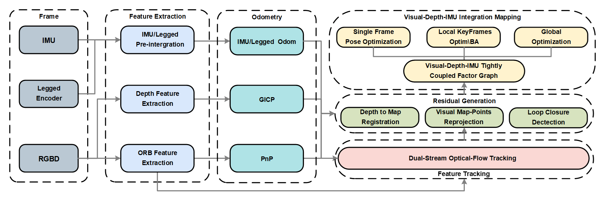
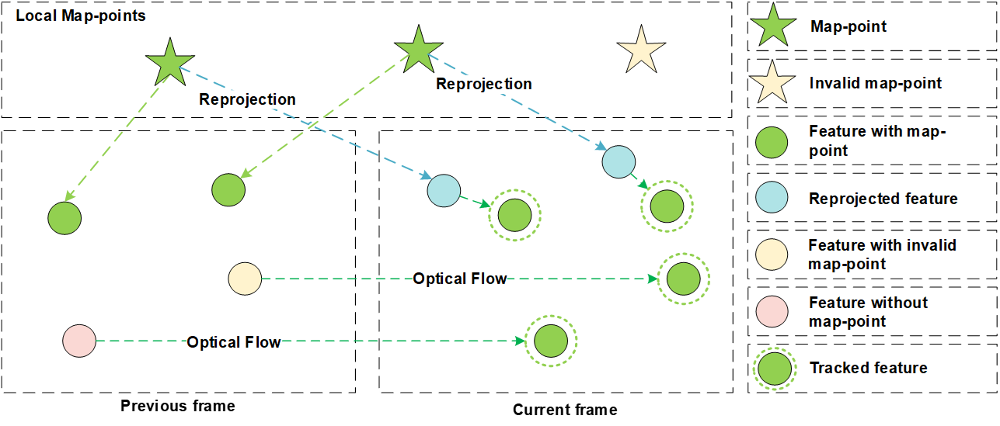
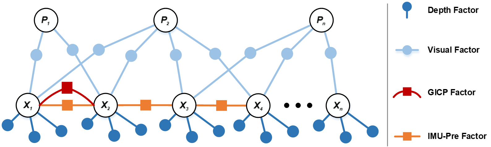

# GeoFlow-SLAM: A Robust Tightly-Coupled RGBD-Inertial Fusion SLAM for Dynamic Legged Robotics

### Our GeoFlow-SLAM pipeline

  

### The dual-stream optical-flow pipeline

  

### GeoFlow-SLAM factor graph model

  

### Our experiment equipment

  

### Video
【# GeoFlow-SLAM IROS2025】 https://www.bilibili.com/video/BV1vYQ5YME24/?share_source=copy_web
